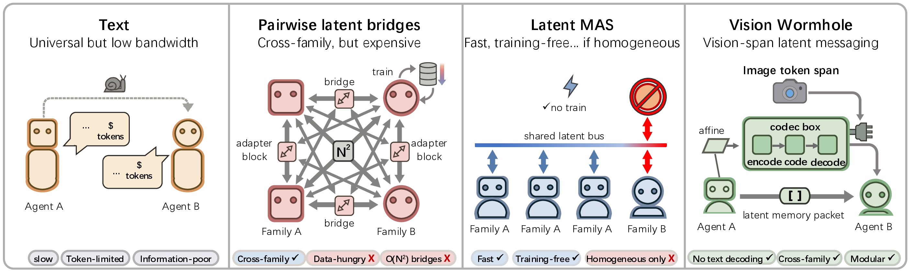

#  [The *Vision Wormhole*: Latent-Space Communication in Heterogeneous Multi-Agent Systems](https://arxiv.org/abs/2602.15382)


Multi-Agent Systems (MAS) powered by Large Language Models have unlocked advanced collaborative reasoning, yet they remain shackled by the inefficiency of discrete text communication, which imposes significant runtime overhead and information quantization loss. While latent state transfer offers a high-bandwidth alternative, existing approaches either assume homogeneous sender-receiver architectures or rely on pair-specific learned translators, limiting scalability and modularity across diverse model families with disjoint manifolds. In this work, we propose the Vision Wormhole, a novel framework that repurposes the visual interface of Vision-Language Models (VLMs) to enable model-agnostic, text-free communication. By introducing a Universal Visual Codec, we map heterogeneous reasoning traces into a shared continuous latent space and inject them directly into the receiver's visual pathway, effectively treating the vision encoder as a universal port for inter-agent telepathy. Our framework adopts a hub-and-spoke topology to reduce pairwise alignment complexity from O(N^2) to O(N) and leverages a label-free, teacher-student distillation objective to align the high-speed visual channel with the robust reasoning patterns of the text pathway. Extensive experiments across heterogeneous model families (e.g., Qwen-VL, Gemma) demonstrate that the Vision Wormhole reduces end-to-end wall-clock time in controlled comparisons while maintaining reasoning fidelity comparable to standard text-based MAS. 



**Note:** *This is an ongoing project. We are actively working on improving the performance, and will include more experiments, baselines, and analyses in the near future. Stay tuned!*

## Updates

- **March 3, 2026:** We added two new baselines: `OCR` (convert text to an image, then feed that image to the next agent) and [`latent_mas_hybrid`](https://github.com/nhminle/LatentMAS-Hybrid). We will update their results in our paper soon.

## Environment Setup

Recommended: Python 3.10+ with a CUDA-enabled PyTorch install.


```bash
pip install transformers==5.0.0 datasets accelerate bitsandbytes einops vllm matplotlib torch torchvision torchaudio tqdm openai wandb nvitop timm
# For LFM model: 
pip install git+https://github.com/huggingface/transformers.git@2a5ba8b53d298ed8421e09831bf96bb6d056a24d pillow
```

## Quick Start

### 1) Train a codec for one model (run once per model)

```bash
python train_vision_latent_mas_codec_new.py \
  --model_name "Qwen/Qwen3-VL-2B-Thinking" \
  --vision_codec_path checkpoints/codec_qwen3vl2b_mixed_cose_ocr_prm800k_large.pt \
  --vision_codec_partial_ckpt_path checkpoints/codec_qwen3vl2b_mixed_cose_ocr_prm800k_large.partial.pt \
  --vision_codec_anchor_texts_path data/vision_codec_anchor_text/mixed_cose_ocr_prm800k.jsonl \
  --vision_codec_dim 512 \
  --vision_codec_tokens 1024 \
  --vision_codec_img_tokens 256 \
  --vision_codec_heads 8 \
  --vision_codec_layers 6 \
  --vision_codec_dropout 0.10 \
  --vision_codec_train_steps 400 \
  --vision_codec_train_batch_size 2 \
  --vision_codec_train_lr 2e-4 \
  --latent_steps 1024 \
  --vision_codec_skip_alignment_if_single 1 \
  --vision_codec_save_per_model 1
```

### 2) Merge codecs across model families

```bash
# Example: merge Qwen3-VL-2B and LFM2.5-VL-1.6B codecs.
# (Run step 1 for each model first to produce both checkpoints.)
python merge_vision_codec_checkpoints.py \
  --codec_paths checkpoints/codec_qwen3vl2b_mixed_cose_ocr_prm800k_large.pt checkpoints/codec_lfm25vl16b_mixed_cose_ocr_prm800k_large.pt \
  --vision_codec_path checkpoints/codec_lfm25_16b_qwen3vl2b_merged.pt \
  --agent_model_names "Qwen/Qwen3-VL-2B-Thinking,LiquidAI/LFM2.5-VL-1.6B" \
  --ref_model_name "Qwen/Qwen3-VL-2B-Thinking" \
  --vision_codec_anchor_texts_path data/vision_codec_anchor_text/mixed_cose_ocr_prm800k.jsonl \
  --vision_codec_align_max_anchors 300 \
  --vision_codec_align_batch_size 2 \
  --latent_steps 1024
```

### 3) (Optional) Build anchor-text files from datasets

```bash
python scripts/preprocess_dataset.py \
  --datasets "salesforce/cos_e,nvidia/opencodereasoning,openai/prm800k" \
  --splits "validation,split_0,train" \
  --limit_per_dataset 1000 \
  --shuffle \
  --format jsonl \
  --out data/vision_codec_anchor_text/mixed_custom.jsonl
```

### 4) Launch partitioned experiments with `launch_partition_run.sh` (2-model example)

We have provided a convenient script `launch_partition_run.sh` that handles the entire workflow of partitioning, caching, and running experiments across multiple GPUs. You can customize the environment variables to specify your models, tasks, methods, and other parameters. Here's an example command to run a partitioned experiment with two models (Qwen3-VL-2B-Thinking and LFM2.5-VL-1.6B) using the merged codec checkpoint:

```bash
mkdir -p logs
mkdir -p preds_jsonl
nohup env \
  RUN_NAME=exp_lfm25_qwen2b_vcodec \
  GPUS=0,1,2,3,4,5,6,7 \
  GPUS_PER_JOB=1 \
  TASKS=gsm8k,arc_easy,arc_challenge,gpqa,medqa,mbppplus,humanevalplus,aime2024,aime2025 \
  METHODS=vision_latent_mas_codec_new \
  AGENT_MODEL_NAMES="LiquidAI/LFM2.5-VL-1.6B,Qwen/Qwen3-VL-2B-Thinking" \
  ROLE_MODEL_MAP='{"planner":0,"critic":1,"refiner":0,"judger":1}' \
  AGENT_DEVICES=cuda:0 \
  VISION_CODEC_PATH=checkpoints/codec_lfm25_16b_qwen3vl2b_merged.pt \
  VISION_CODEC_DECODE_CHUNKS=1 \
  VISION_CODEC_DUMMY_IMAGE_COUNT=1 \
  VISION_CODEC_DUMMY_IMAGE_SIZE=224 \
  GENERATE_BS=12 \
  AUTO_GENERATE_BS=1 \
  OOM_RETRY_LEVELS=12,8,4,2,1 \
  LATENT_STEPS=1024 \
  SCHEDULER=queue \
  LOG_DIR=logs/exp_lfm25_qwen2b_vcodec \
  JSONL_DIR=preds_jsonl/exp_lfm25_qwen2b_vcodec \
  SUMMARY_JSON=logs/exp_lfm25_qwen2b_vcodec_partition_pool_summary.json \
  bash scripts/launch_partition_run.sh \
  > logs/exp_lfm25_qwen2b_vcodec.launch.log 2>&1 < /dev/null &

```

This writes per-partition logs to `logs/` and predictions to `preds_jsonl/` by default.

## Citation
```bibtex
@misc{liu2026vision,
      title={The Vision Wormhole: Latent-Space Communication in Heterogeneous Multi-Agent Systems}, 
      author={Xiaoze Liu and Ruowang Zhang and Weichen Yu and Siheng Xiong and Liu He and Feijie Wu and Hoin Jung and Matt Fredrikson and Xiaoqian Wang and Jing Gao},
      year={2026},
}
```

## Acknowledgements
We thank [Contextual AI](https://contextual.ai) for their support and resources that made this research possible. We also thank the open-source community for providing invaluable tools and datasets that facilitated our experiments. We build our code based on the [LatentMAS](https://github.com/Gen-Verse/LatentMAS) codebase, and we are grateful for their contributions to the field of multi-agent systems. We also thank the developers of the various models and libraries we used in our experiments.
